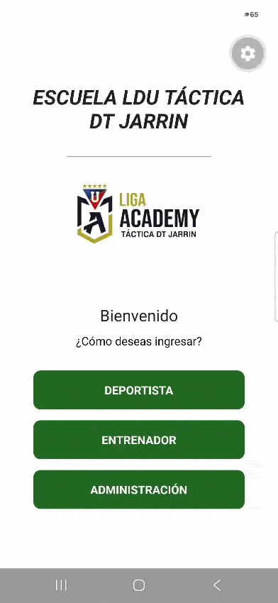

# escuela-futbol-app
Aplicación móvil para la gestión administrativa de una escuela de fútbol

## 💡 ¿Por qué surgió este proyecto?
Este proyecto nació de la necesidad real de optimizar y digitalizar la gestión de una escuela de fútbol local. El objetivo principal es facilitar el control de los alumnos, la organización de los horarios de entrenamiento y el seguimiento administrativo, reemplazando los procesos manuales por una herramienta móvil eficiente, intuitiva y accesible.

## 📱 Estado del Proyecto
🚧 **En desarrollo activo** - Actualmente me encuentro diseñando las interfaces y estructurando la navegación principal en Visual Studio Code.

### Próximas Características:
- [x] Maquetado de la pantalla de inicio y botones principales.
- [x] Conexión de navegación entre pantallas.
- [ ] Diseño interno de cada pantalla
- [ ] Lógica para gestión de administración
- [ ] Lógica para gestión de alumnos y horarios.

## 📱 Vista Previa

